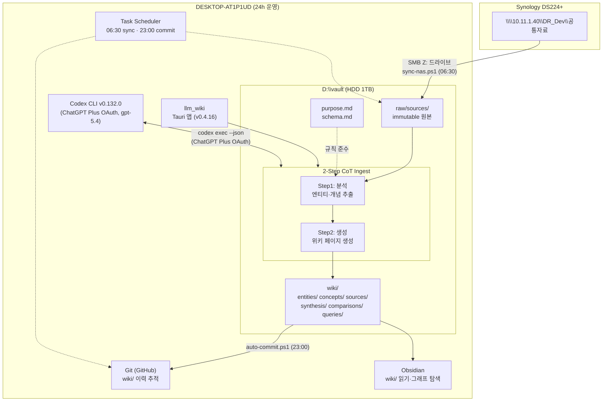

# LLM Wiki Knowledge Base — 구축 및 운영 계획

## 개요

Andrej Karpathy의 [LLM Wiki 패턴](https://gist.github.com/karpathy/442a6bf555914893e9891c11519de94f)과
[nashsu/llm_wiki](https://github.com/nashsu/llm_wiki) 데스크톱 앱,
[kepano/obsidian-skills](https://github.com/kepano/obsidian-skills) 에이전트 스킬을 결합하여
회사 NAS 자료를 구조화된 지식 베이스로 자동 변환·유지하는 시스템.

## 핵심 원칙

- **사람**: 무엇을 넣을지, 무엇을 물어볼지만 결정
- **LLM**: 요약, 교차참조, 백링크 갱신, 모순 표시 전부 수행
- **지식은 컴파일**: 매번 재합성(RAG)이 아닌 사전 컴파일 + 점진 갱신

## 대상 시스템

| 항목 | 사양 |
|------|------|
| PC | DESKTOP-AT1P1UD |
| CPU | Intel i5-10500 @ 3.10GHz (6C/12T) |
| RAM | 16GB |
| 스토리지 | 256GB NVMe SSD (C:) + 1TB HDD (D:) |
| GPU | Intel UHD 630 (내장) |
| OS | Windows 10 Pro 64bit |
| 운영 모드 | 24시간 상시 가동 |

## 현재 상태

> **Phase 4 전량 인제스트 진행 중 — wiki 2,037 페이지 생성, DHF+연구소 464건 처리 중** (2026-06-09 기준)

| 산출물 | 상태 |
|--------|------|
| 설계 문서 5종 (01~05) | ✅ 완료 |
| 운영 스크립트 9종 (ps1) | ✅ 완료 |
| E2E 체크리스트 (TC-01~TC-12, 46항목) | ✅ 완료 |
| Phase 0: 환경 설정 (전원, 디렉터리, PATH) | ✅ 완료 |
| Phase 1: SW 설치 (Node 24.x, Rust 1.95, Git 2.42) | ✅ 완료 |
| Phase 1: llm_wiki 빌드 및 설치 (v0.4.16) | ✅ 완료 |
| Phase 2: 프로젝트 초기화 (vault, purpose.md, Git) | ✅ 완료 |
| Phase 3: NAS Z:\ 매핑 (\\10.11.1.40\DR_Dev\공통자료) | ✅ 완료 |
| Phase 3: sync-nas.ps1 스케줄 (매일 06:30) | ✅ 완료 |
| Phase 3: auto-commit.ps1 스케줄 (매일 23:00) | ✅ 완료 |
| LLM 제공자: Codex CLI — ChatGPT Plus OAuth (gpt-5.4) | ✅ 완료 |
| Phase 4 파일럿: 테스트 34건 → **34/34 성공** (2026-06-08) | ✅ 완료 |
| Phase 4 전량: wiki/sources **2,037 페이지** 생성 (품질 분석 포함) | ✅ 완료 |
| Phase 4 배치: DHF 457건 + 연구소 7건 = **464건 처리 중** | 🔄 진행 중 |
| Phase 4 예정: RA 13,045건 등 나머지 ~14K건 배치 투입 | ⏳ 대기 |

## 구축 로드맵

```
Phase 0  사전 준비 (전원설정, 디렉터리, SW확인)     ~1h
Phase 1  소프트웨어 설치 (Node, Rust, Git, llm_wiki) ~2h
Phase 2  프로젝트 초기화 (vault, API, Git)           ~30m
Phase 3  NAS 동기화 설정 (SMB Z: 매핑, 스케줄)        ~1h
Phase 4  전량 인제스트 (~51,000 파일, 7개 폴더)        ~2-3m
Phase 5  안정화 및 확장 (자료 확장, 자동화 완성)      ~2-4w
```

각 Phase의 상세 작업은 [Issues](../../issues)에서 추적.

## 시스템 아키텍처



### 일일 운영 사이클

| 시각 | 자동화 작업 | 스크립트 |
|------|------------|---------|
| 06:30 | NAS(Z:\) → raw/sources 선별 복사 | `sync-nas.ps1` |
| 수시 | raw/ 변경 감지 → 인제스트 | llm_wiki auto-watch |
| 수시 | 사용자 쿼리 응답 | llm_wiki 채팅 |
| 23:00 | wiki/ Git 자동 커밋 & 푸시 | `auto-commit.ps1` |
| 일 09:00 | 시스템 상태 점검 | `health-check.ps1` |

### 3계층 소유권 모델

| 역할 | 소유 | 행동 |
|------|------|------|
| **사람** | raw/, schema | 자료 투입, 규칙 정의, 질문 |
| **LLM** | wiki/ | 분석, 생성, 교차참조, 모순 표시 |
| **자동화** | 스케줄 | 동기화, 커밋, 점검 |

## 3계층 데이터 아키텍처

| 계층 | 경로 | 소유자 | 규칙 |
|------|------|--------|------|
| Raw Sources | `D:\vault\llm-wiki-vault\raw\sources\` | 사람 | 불변, append-only |
| Wiki | `D:\vault\llm-wiki-vault\wiki\` | LLM | LLM만 쓰기, 사람은 읽기만 |
| Schema | `purpose.md`, `schema.md` | 사람 | LLM이 준수할 규칙 정의 |

## 파일 구조

```
├── docs/
│   ├── 01-SYSTEM-SPEC.md        # 시스템 사양서
│   ├── 02-BUILD-PLAN.md         # 구축 계획 (Phase 0~5)
│   ├── 03-OPERATION-GUIDE.md    # 운영 가이드
│   ├── 04-E2E-TEST-PLAN.md      # E2E 검증 계획 (TC-01~TC-12)
│   └── 05-ARCHITECTURE.md       # 아키텍처 설계
├── scripts/
│   ├── setup-env.ps1            # 환경 설정 (전원, 디렉터리, PATH, SW)
│   ├── install-deps.ps1         # Node.js + Rust 설치
│   ├── fix-encoding.ps1         # .ps1 UTF-8 BOM 일괄 적용
│   ├── sync-nas.ps1             # NAS → vault 선별 복사
│   ├── auto-commit.ps1          # wiki/ Git 자동 커밋
│   ├── health-check.ps1         # 시스템 상태 점검
│   ├── watchdog-ingest.ps1      # 인제스트 자동 감시·재시작 (5분 주기)
│   ├── batch-enqueue.ps1        # 폴더 단위 배치 큐 투입
│   └── preprocess-queue.ps1     # 대용량 파일 청크 분할 후 재투입
├── tests/
│   └── e2e-checklist.md         # E2E 체크리스트 (인쇄용)
├── CLAUDE.md                    # Claude Code 가이드
└── README.md
```

## LLM 제공자 설정

llm_wiki는 **OpenAI Codex CLI** (ChatGPT Plus 구독, OAuth 인증)를 사용합니다.
API 키 없이 ChatGPT Plus 월 구독으로 동작합니다.

```powershell
# Codex CLI 설치
npm install -g @openai/codex

# ChatGPT Plus 계정으로 OAuth 로그인 (브라우저 팝업)
codex login --device-auth

# 동작 확인
codex login status   # → "Logged in using ChatGPT"
```

llm_wiki Settings에서 프리셋 선택:
- **Provider**: Codex CLI (local)
- **Model**: `gpt-5.4` (ChatGPT Plus 계정 지원 모델)

## 빠른 시작

```powershell
# 1. 레포 클론
git clone https://github.com/hnabyz-bot/nas-llm.git
cd nas-llm

# 2. UTF-8 BOM 적용 (한국어 ps1 필수)
.\scripts\fix-encoding.ps1

# 3. 환경 설정 (PowerShell 관리자 권한)
.\scripts\setup-env.ps1

# 4. SW 설치 (Node.js, Rust 미설치 시)
.\scripts\install-deps.ps1

# 5. Codex CLI 설치 및 로그인
npm install -g @openai/codex
codex login --device-auth

# 6. llm_wiki 실행: C:\dev\llm_wiki\src-tauri\target\release\llm-wiki.exe
# 7. E2E 검증 → docs/04-E2E-TEST-PLAN.md 참조
```

## 라이선스

내부 사용 전용
# Current Operating Update - 2026-06-19

The active source-level ingest queue has been reclassified for RA/regulatory
value before continuing bulk ingest. The queue remains unchanged; the
classification is a dry-run report used to choose the first official-quality
ingest wave. Because the source corpus is too large to wait for flat full
ingest, P0 now has a meaningful-content triage step before LLM full ingest.

- Active queue candidates: 69,549
- P0 active RA/submission candidates: 9,027
- P1 core RA evidence candidates: 7,941
- P2 standards/QMS/traceability candidates: 7,959
- P4 archive/duplicate candidates: 43,403
- Latest local report: `reports/ra-ingest-priority-20260617052118`
- Latest P0 triage report: `reports/p0-meaningful-triage-20260618153500`
- Latest P0 30-source evaluation bundle: `reports/p0-pilot-eval-20260618153600`
- Latest P0 300-source evaluation bundle: `reports/p0-pilot-eval-300-20260618173500`
- Latest P0 expansion checkpoint: `reports/p0-pilot-eval-p0-r901-r1000-202606231431`
- Review document: `docs/08-RA-INGEST-PRIORITY-REVIEW.md`
- Evaluation document: `docs/09-P0-PILOT-EVALUATION.md`
- GitHub tracking issue: https://github.com/hnabyz-bot/nas-llm/issues/17

Decision: P0 must be processed first to secure official wiki quality for the
most important RA service surface. The current single-lane llm-wiki ingest rate
is not sufficient for a weeks-scale target, so P0 needs a controlled
official-quality acceleration plan rather than a flat full-queue ingest.

P0 meaningful-content triage result:

- P0 sources: 9,027
- Canonical normalized body groups: 1,817
- Full-wiki representative candidates: 1,775
- Canonical duplicate sources: 6,491
- Needs review for low text: 94
- Needs recovery for empty text: 667
- First full-wiki pilot: 300 representative sources
- Expected avoided full LLM calls before pilot: 7,252 (80.3%)
- First 30-source extraction evaluation: 30/30 Codex CLI outputs passed JSON
  validation with 0 blocker flags while keeping the app stopped
- 300-source extraction evaluation: 300/300 final outputs passed JSON/source
  validation after chunked fallback for 5 large/context-heavy sources; final
  QA found 0 validation errors, 6,491 evidence records, and 1,113 review flags
- P0 expansion checkpoint ranks 301-400: 100/100 final outputs passed
  JSON/source validation after chunked fallback for 1 context-heavy source;
  final QA found 0 validation errors, 0 page-marker leakage items, 1,958
  evidence records, and 375 review flags
- P0 expansion checkpoint ranks 401-500: 100/100 final outputs passed
  JSON/source validation without chunked fallback; final QA found 0 validation
  errors, 0 page-marker leakage items, 2,076 evidence records, and 379 review
  flags
- P0 expansion checkpoint ranks 501-600: 100/100 final outputs passed
  JSON/source validation without chunked fallback; final QA found 0 validation
  errors, 0 page-marker leakage items, 2,204 evidence records, and 395 review
  flags
- P0 expansion checkpoint ranks 601-700: 100/100 final outputs passed
  JSON/source validation without chunked fallback; final QA found 0 validation
  errors, 0 page-marker leakage items, 2,123 evidence records, and 360 review
  flags
- P0 expansion checkpoint ranks 701-800: 100/100 final outputs passed
  JSON/source validation after one single-row JSON escape retry and without
  chunked fallback; final QA found 0 validation errors, 0 page-marker leakage
  items, 1,656 evidence records, and 377 review flags
- P0 expansion checkpoint ranks 801-900: 100/100 final outputs passed
  JSON/source validation after two single-row JSON escape retries and without
  chunked fallback; final QA found 0 validation errors, 0 page-marker leakage
  items, 1,782 evidence records, and 378 review flags
- P0 expansion checkpoint ranks 901-1000: 100/100 final outputs passed
  JSON/source validation with chunked fallback for one large source; final QA
  found 0 validation errors, 0 page-marker leakage items, 1,990 evidence
  records, and 381 review flags
